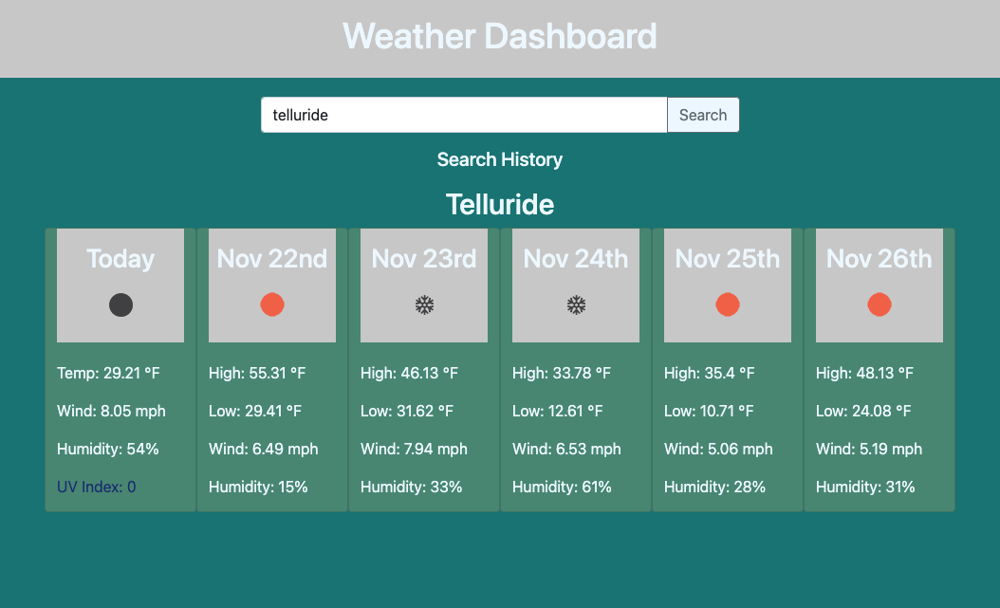

# hw6-weather-dashboard

## Motivation

Everyone likes to have accurate weather right at their fingertips. With this app you can, in a very simple and easy to read interface that gives you all the information you need to plan your week.

## Features

For this project I used 2 different API's from the same company Open Weather Map. The first one, Geocoding API takes the users input of a city and returns latitude and longitude coordinates which are then passed into the One Call Weather API which returns current and future weather information. I used the current weather information for the 'Today' box in the forcast and the future forcast data to display data in each of the following boxes. Moment js was also used to convert the unix returned in the API data to determine the actual date of the forcasted data.

After you search for a city, that city is saved under search history to easily return to that cities weather forcast!

## Screenshot

## Deployed link

https://elliscj.github.io/hw6-weather-dashboard/

## License

MIT License

Copyright (c) [2021] [Cameron Ellis]

Permission is hereby granted, free of charge, to any person obtaining a copy
of this software and associated documentation files (the "Software"), to deal
in the Software without restriction, including without limitation the rights
to use, copy, modify, merge, publish, distribute, sublicense, and/or sell
copies of the Software, and to permit persons to whom the Software is
furnished to do so, subject to the following conditions:

The above copyright notice and this permission notice shall be included in all
copies or substantial portions of the Software.

THE SOFTWARE IS PROVIDED "AS IS", WITHOUT WARRANTY OF ANY KIND, EXPRESS OR
IMPLIED, INCLUDING BUT NOT LIMITED TO THE WARRANTIES OF MERCHANTABILITY,
FITNESS FOR A PARTICULAR PURPOSE AND NONINFRINGEMENT. IN NO EVENT SHALL THE
AUTHORS OR COPYRIGHT HOLDERS BE LIABLE FOR ANY CLAIM, DAMAGES OR OTHER
LIABILITY, WHETHER IN AN ACTION OF CONTRACT, TORT OR OTHERWISE, ARISING FROM,
OUT OF OR IN CONNECTION WITH THE SOFTWARE OR THE USE OR OTHER DEALINGS IN THE
SOFTWARE.
